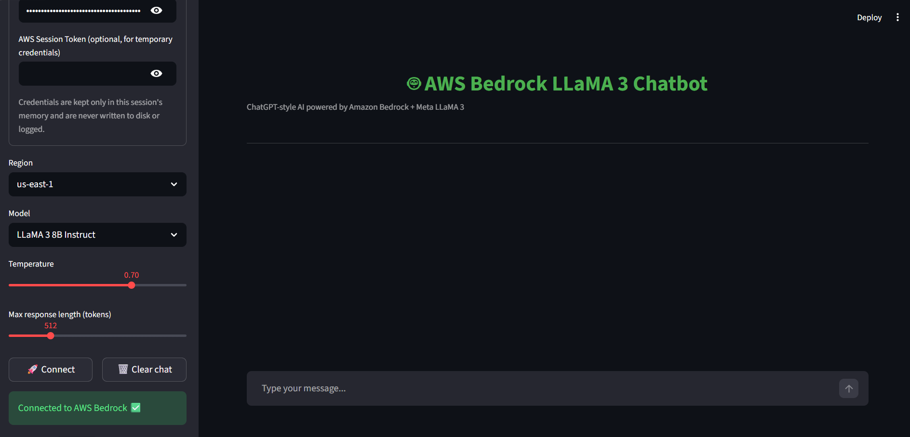

# Bedrock-llama3-chatbot

A ChatGPT-style chatbot UI built with **Streamlit**, powered by **Meta LLaMA 3** models served through **Amazon Bedrock**.


---

## Overview

This app lets you chat with LLaMA 3 (8B or 70B Instruct) directly from a browser, using your own AWS Bedrock access. Conversation history is formatted with LLaMA 3's native chat template so the model receives full multi-turn context, not just the latest message.

---

## Features

- 🔐 Enter AWS credentials securely in-session (never persisted to disk)
- 🌎 Region selector (`us-east-1`, `us-west-2`)
- 🧠 Model selector (LLaMA 3 8B / 70B Instruct)
- 🎛️ Adjustable temperature and max response length
- 💬 Multi-turn chat with proper LLaMA 3 prompt formatting
- 🗑️ One-click chat reset
- ⚠️ Clear error handling for auth and invocation failures

---

## Requirements

- Python 3.9+
- An AWS account with **Bedrock model access enabled** for Meta LLaMA 3 in your chosen region
- AWS credentials (Access Key ID + Secret Access Key, or temporary credentials with a session token) belonging to an IAM identity with `bedrock:InvokeModel` permission

---

## Installation

```bash
git clone https://github.com/<your-username>/bedrock-llama3-chatbot.git
cd bedrock-llama3-chatbot
pip install -r requirements.txt
```

## Usage

```bash
streamlit run bedrock_chatbot.py
```

1. Open the sidebar and enter your AWS Access Key, Secret Key, and (optionally) a session token.
2. Choose your region and model.
3. Click **Connect**.
4. Start chatting in the main window.

---

## Screenshots

**AWS configuration panel**


**Connected and ready to chat**


**Sample conversation**


---

## Project Structure

```
bedrock-llama3-chatbot/
├── Bedrock_chatbot.py   # Main Streamlit app
├── requirements.txt     # Python dependencies
├── Screenshots/         # App screenshots used in this README
└── README.md
```

---

## Security Notes

- Credentials are stored only in Streamlit's in-memory session state for the duration of the browser session — they are never written to disk, logged, or sent anywhere except directly to AWS via `boto3`.
- For production use, prefer environment variables, an IAM role, or AWS SSO over pasting long-lived access keys into the UI.

## Roadmap / Ideas

- Streaming token-by-token responses via `invoke_model_with_response_stream`
- Support for additional Bedrock models (Claude, Titan, Mistral)
- Downloadable chat transcripts
- Dockerfile for one-command deployment

---

## Author

**Mallareddygari Gayathri** — [GitHub: Gayathri-Reddy874](https://github.com/Gayathri-Reddy874)

---

## License

MIT
